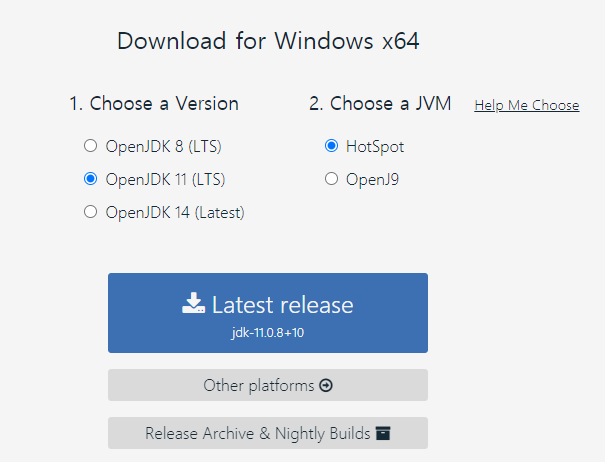
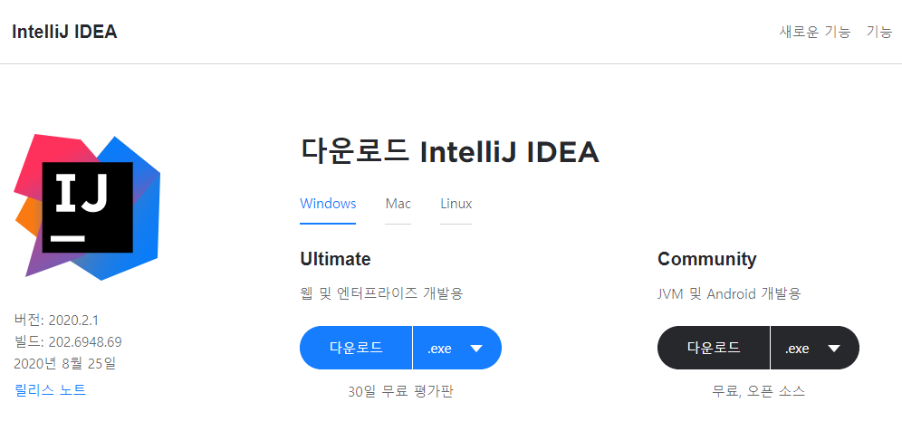
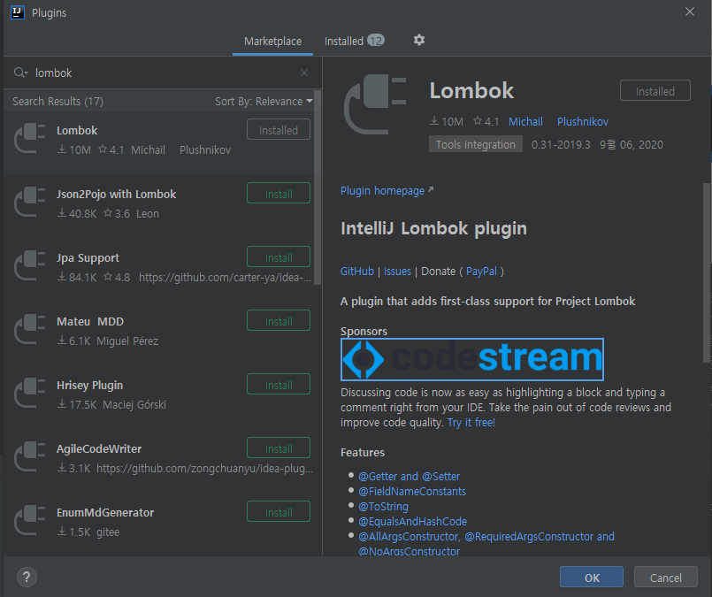
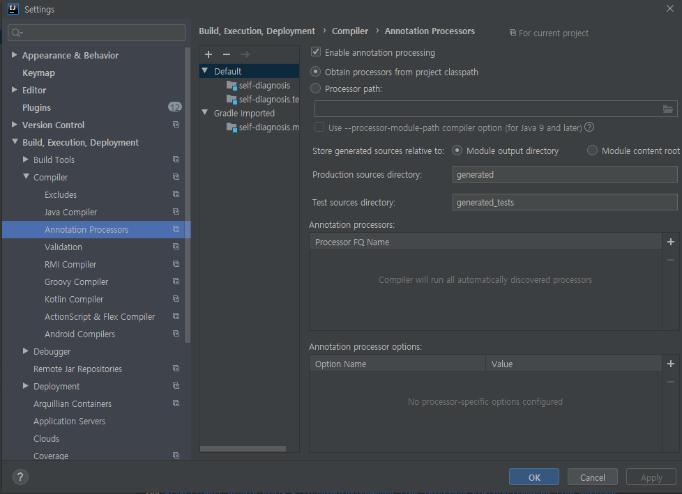
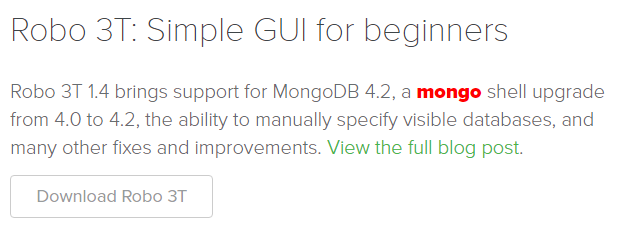

# 자가진단 관리 서비스 (Self Diagnosis Project)
## 기술스택 (Tech Stack)
- Java 11 (from AdoptOpenJDK)
- Spring Boot v2.2.9 with Embedded Tomcat
- Gradle
- MongoDB
- Javascript ES6
- Thymeleaf
- HTML5 & CSS3
- Bootswatch v4.5.2 (Bootstrap)
## 개발환경 구축 (Environment Setup)
1. **[Git](https://git-scm.com/downloads) 최신버전 설치**
   - 클라이언트 프로그램은 개별 사용자 별로 사용
     - GUI 툴로 소스트리, 깃헙데스크탑 등이 있음
     - IntelliJ 상에서도 Git 이용 가능
1. **[AdoptOpenJDK](https://adoptopenjdk.net/]) 11 설치**
    
    - Java Version : OpenJDK 11 (LTS)
    - JVM : HotSpot 
1. **[IntelliJ](https://www.jetbrains.com/ko-kr/idea/download/#section=windows) 최신버전 설치**
   
   - Ultimate Edition : 30일 무료 이용 / 이후 유료 결제. 개인이 구매하더라도 업무용으로 사용 가능
   - Community Edition : 기능 일부를 제한하여 배포한 무료 버전. Apache 2.0 라이선스를 따르므로 업무용으로 사용 가능  
1. **프로젝트 설정**
   1. IntelliJ 실행 후 상단 바에서 VCS > Checkout from Version Control > Git 클릭
   1. URL에 Repo [URL](https://github.com/self-diagnosis-team/self-diagnosis-project-2.git) 입력 > Clone
   1. 해당 프로젝트 화면으로 진입
   1. Ctrl + Shift + A를 눌러 Plugins로 진입
   1. Marketplace 탭에서 "Lombok" 검색 후 설치
        
        > 롬복이 궁금하다면 [이곳](https://velog.io/@ddusi/Spring-2)을 참고                                                                                              
   1. Setting > Build, Execution, Deployment > Compiler > Annotation Processors > "Enable Annotation Process" 활성화
        
1. **MongoDB 연결 ([RoboMongo](https://robomongo.org/download) 설치)**
    
    1. 사이트에서 Robo 3T 다운로드 후 설치
    1. 프로그램 실행 - Create 클릭하여 DB 연결 정보 설정
        - Connection 탭에서 Address에 MongoDB 인스턴스 IP 입력
        - Authentication 탭에서 Database 및 User Name, Password 입력
            > 인스턴스 정보는 [application.properties](./src/main/resources/application.properties) 파일 참고
        - Test 버튼 눌러 연결이 잘 수행되는지 확인 
    1. 해당 프로필로 Connect 되는지 확인